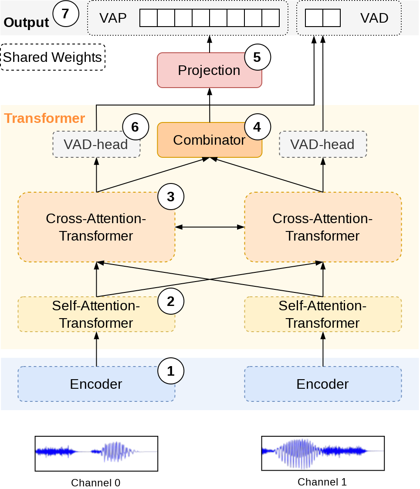

# VoiceActivityProjection

Voice Activity Projection is a Self-supervised objective for Turn-taking Events. This is an extended version which trains a stereo model (mono is still possible) that does not require any VAD information as input BUT do require separate channels for both speakers. Overbleed between the channels is fine as long as you have access to the VAD information (used as label during training). The stereo model greatly simplifies inference where the only input is a stereo waveform. The model is trained on a multitask loss defined by the original VAP-objective and a VAD-objective (predict the current voice activity over each frame for the two separate channels).


### VapStereo

<div style='margin-bottom: 50px; padding: 10px; background: white; border-radius: 5px'>

</div>
1. Audio encoder
    - (Default) [CPC facebookresearch](https://github.com/facebookresearch/CPC_audio))
    - Causal / incremental
2. Self attention
    - (Default) 1 layer
    - Shared weights
3. Cross attention between speakers
    - (Default) 3 layers 
    - Shared weights
4. Combine the output from the two channels
    - The model is channel agnostic and used for both channels
5. Linear projection layer
    - Map to VAP vocabulary/states
6. Voice activity detection
    - Predict the voice activity for both channels independently
    - Good for "bleed-over", background noise, etc
7. VAP objective
    - 256 states
    - Representing the next 2s of dialog

The model is a GPT-like transformer model, using [AliBI attention](https://ofir.io/train_short_test_long.pdf), which operates on pretrained speech representation (extract by submodule defined/trained/provided by [CPC facebookresearch](https://github.com/facebookresearch/CPC_audio)).
A state-dict tensor is included in the `examples/` folder:
* `example/VAP_3mmz3t0u_50Hz_ad20s_134-epoch9-val_2.56.pt`


## Installation
* Create conda env: `conda create -n voice_activity_projection python=3`
  - source env: `conda source voice_activity_projection`
  - Working with `python 3.9` but I don't think it matters too much...
* PyTorch: `conda install pytorch torchvision torchaudio cudatoolkit=11.6 -c pytorch`
    - Have not tested all versions but should work from `torch 1.12.1` as of time of writing...
* Install **`VoiceActivityProjection`** (this repo):
  * cd to root directory and run:
    * `pip install -r requirements.txt`
    * `pip install -e .`
* [OPTIONAL] Dependencies for training:
  * **DATASET**
    * Install [vap_dataset](https://github.com/ErikEkstedt/vap_dataset)
      * `git clone https://github.com/ErikEkstedt/vap_dataset.git`
      * cd to repo, and install dependencies: `pip install -r requirements.txt`
      * Install repo: `pip install -e .`


## Citation

```latex
@inproceedings{ekstedt22_interspeech,
  author={Erik Ekstedt and Gabriel Skantze},
  title={{Voice Activity Projection: Self-supervised Learning of Turn-taking Events}},
  year=2022,
  booktitle={Proc. Interspeech 2022},
  pages={5190--5194},
  doi={10.21437/Interspeech.2022-10955}
}
```

```latex
@inproceedings{ekstedt-skantze-2022-much,
    title = "How Much Does Prosody Help Turn-taking? Investigations using Voice Activity Projection Models",
    author = "Ekstedt, Erik  and
      Skantze, Gabriel",
    booktitle = "Proceedings of the 23rd Annual Meeting of the Special Interest Group on Discourse and Dialogue",
    month = sep,
    year = "2022",
    address = "Edinburgh, UK",
    publisher = "Association for Computational Linguistics",
    url = "https://aclanthology.org/2022.sigdial-1.51",
    pages = "541--551",
}
```
